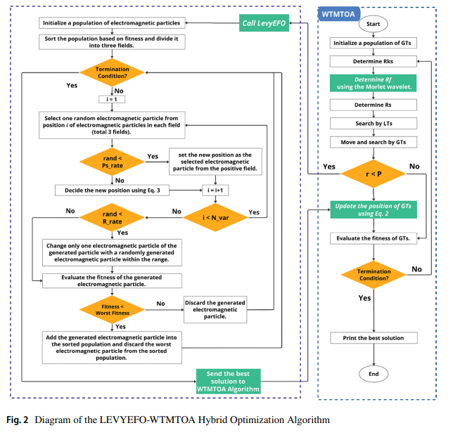

# LEVYEFO-WTMTOA: A Hybrid Optimization Algorithm

This repository provides the official MATLAB implementation of **LEVYEFO-WTMTOA**, a novel hybrid metaheuristic for solving complex global optimization and engineering design problems. The algorithm merges:

- 🧭 **Multi-Tracker Optimization Algorithm (MTOA)**
- 🌐 **Electromagnetic Field Optimization (EFO)**
- 🔀 **Levy Flights** for stochastic position updates
- 🌊 **Morlet Wavelet Transform** for adaptive search behavior

---

## 📄 Publication

📘 *The Journal of Supercomputing*, Springer Nature, 2025  
📝 DOI: [10.1007/s11227-024-06856-6](https://doi.org/10.1007/s11227-024-06856-6)  
📤 Volume 81, Article 432

---

## 🧠 Algorithm Summary

**LEVYEFO-WTMTOA** addresses the limitations of local search stagnation and poor exploration by combining the field-based intelligence of EFO with the group coordination of MTOA, further boosted by wavelet-based search tuning and Levy jumps.

It incorporates:
- Three-region particle movement in **EFO** based on electromagnetic polarity
- Position refinement using **Levy flights**
- Enhanced **GT–LT tracker hierarchy** in **MTOA**
- Dynamic scaling of search radii using **Morlet wavelets**

This hybrid framework demonstrates high convergence accuracy and robustness in high-dimensional search spaces.

---

## 📊 Algorithm Framework

The following diagram presents the full integration workflow of the hybrid approach:



*Fig. 2: Diagram of the LEVYEFO-WTMTOA Hybrid Optimization Algorithm, integrating LevyEFO with wavelet-enhanced MTOA.*

---

## 📦 Repository Contents

```bash
LEVYEFO-WTMTOA/
├── IMTOA_DP3.m         # GT-LT tracker-based optimizer
├── EFO.m               # Electromagnetic Field Optimization
├── initialization.m    # Initialization strategy
├── New_GT.m            # Global tracker strategy
├── insert_in_pop.m     # Insertion strategy for particles
├── cec17_func.cpp      # Benchmark interface (MEX needed)
├── diagram.png         # Algorithm overview figure
├── framework.png       # Full integration workflow diagram
├── README.md
```

---

## ⚙️ Requirements

- MATLAB R2020b or later
- MEX-compatible compiler (e.g., Microsoft Visual C++ or GCC)
- Tested on Windows and Linux

---

## ▶️ How to Run

### Compile CEC benchmark (once):
```matlab
mex cec17_func.cpp
```

### Execute LEVYEFO-WTMTOA:
```matlab
IMTOA_DP3()
```

- Use `EFO.m` for standalone EFO experiments
- Modify objective function inline for custom engineering problems

---

## ✅ Benchmarks & Case Studies

- **CEC2018 Functions (10D–30D)**:
  - 20–34% better mean error than GA, PSO, MVOLevy, MEFO, GSA, COA, MTOA, and EFO

- **Spring Design Problem**:
  - Achieved cost minimization improvement of 31.03%

- **Welded Beam Design**:
  - Max improvement of 32.15% over best competitors

---

## 🧾 Citation

If you use this code in your research, please cite the paper:

```bibtex
@article{SafiEsfahani2025LEVYEFO,
  title={LEVYEFO-WTMTOA: the hybrid of the multi-tracker optimization algorithm and the electromagnetic field optimization},
  author={Safi-Esfahani, Faramarz and Mohammadhoseini, Leili and Larian, Habib and Mirjalili, Seyedali},
  journal={The Journal of Supercomputing},
  volume={81},
  number={432},
  year={2025},
  publisher={Springer},
  doi={10.1007/s11227-024-06856-6}
}
```

---

## 👨‍🔬 Authors

- **Faramarz Safi-Esfahani** — University of Technology Sydney  
- **Leili Mohammadhoseini**, **Habib Larian** — Islamic Azad University  
- **Seyedali Mirjalili** — Torrens University Australia

---

## 📬 Contact

📧 faramarz.safi@yahoo.com

---

## 📘 License

This code is shared for academic use. Please cite the corresponding article.
