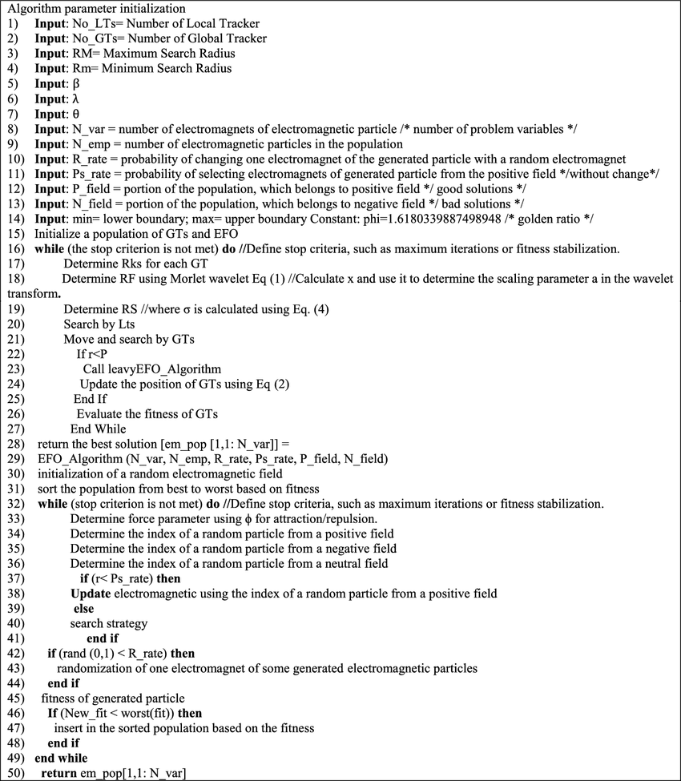

# LEVYEFO-WTMTOA: A Hybrid Optimization Algorithm

This repository provides the implementation of **LEVYEFO-WTMTOA**, a novel hybrid metaheuristic that integrates:

- **Multi-Tracker Optimization Algorithm (MTOA)**  
- **Electromagnetic Field Optimization (EFO)**  
- Enhanced with **Levy Flights** and **Morlet Wavelet Transform**

📄 Published in *The Journal of Supercomputing* (Springer, 2025)  
🔗 [DOI: 10.1007/s11227-024-06856-6](https://link.springer.com/article/10.1007/s11227-024-06856-6)

---

## 🧠 Algorithm Highlights

LEVYEFO-WTMTOA addresses key optimization challenges:

- Escapes **local optima** using Levy flights  
- Balances **exploration vs. exploitation** with EFO dynamics  
- Refines solutions through **MTOA’s GT–LT hierarchy**
- Adapts search radius dynamically using **Morlet wavelet transforms**

The hybrid framework significantly improves convergence in complex engineering and benchmark scenarios.

---

## 📦 Repository Contents

```
📦MTOA_project
├── IMTOA_DP3.m               # Main algorithm script
├── EFO.m                     # Electromagnetic Field Optimization core
├── sortpop.m, insert_in_pop.m, etc.  # Supporting operations
├── cec17_func.cpp            # CEC2017 benchmark function source
├── cec17_func.mexw32 / .mexw64  # Precompiled functions (Windows)
├── diagram.png               # LEVYEFO-WTMTOA algorithm workflow
└── input_data/
    ├── bias_*.txt            # Bias vectors
    └── M_*_D*.txt            # Rotation matrices
```

---

## 📊 Benchmark Settings

- **Benchmark Suite**: CEC2018  
- **Problem Dimensions**: 50, 100  
- **Applications**:  
  - Spring Design Optimization  
  - Welded Beam Design  
- **Average Performance Gain**: Up to **20% improvement** in mean error  
- **Maximum Cost Reduction**:  
  - Spring: **31.03%**  
  - Welded Beam: **32.15%**

---

## ▶️ How to Run

### Prerequisites
- MATLAB R2015 or newer
- Windows (32/64-bit) recommended for precompiled `.mex` files

### Steps

1. Open MATLAB
2. Add the project directory to the MATLAB path
3. Run the main script:
   ```matlab
   IMTOA_DP3
   ```

Optional: Compile the benchmark functions manually:

```matlab
mex cec17_func.cpp -DWINDOWS
```

---

## 🖼️ Algorithm Diagram



---

## 📌 Citation

If you use this code, please cite:

```bibtex
@article{safi2025levy,
  title={LEVYEFO-WTMTOA: the hybrid of the multi-tracker optimization algorithm and the electromagnetic field optimization},
  author={Safi-Esfahani, Faramarz and Mohammadhoseini, Leili and Larian, Habib and Mirjalili, Seyedali},
  journal={The Journal of Supercomputing},
  year={2025},
  publisher={Springer},
  doi={10.1007/s11227-024-06856-6}
}
```

---

## 🛠️ Future Work

Planned extensions include:

- Enhanced exploration with MIGO or hybridized EFO variants  
- Real-world applications in cloud task scheduling and neural network training  
- Comparative analysis with computational cost breakdowns  
- Evaluation on high-dimensional benchmarks like TEAM

---

## 📃 License

MIT License or as specified by the authors.

---
